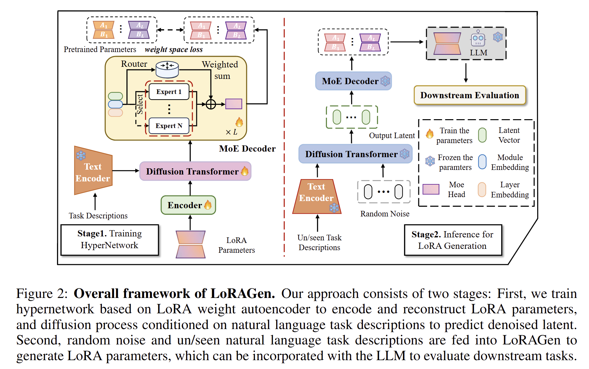

# LoRAGen: Structure-Aware Weight Space Learning for LoRA Generation
This repository contains the official code of paper 'LoRAGen: Structure-Aware Weight Space Learning for LoRA Generation', which was published at **ICLR 2026**.

## Abstract

The widespread adoption of Low-Rank Adaptation (LoRA) for efficient fine-tuning of large language models has created demand for scalable parameter generation methods that can synthesize adaptation weights directly from task descriptions, avoiding costly task-specific training. We present LoRAGen, a structure-aware method for generating LoRA parameters from natural language descriptions. Through empirical analysis of LoRA libraries, we identify two key structural properties of LoRA parameter spaces: non-uniqueness of low-rank decomposition and heterogeneous weight distributions across network modules. These properties necessitate specialized parameter generation methods rather than general weight space learning approaches. LoRAGen employs a latent diffusion model with two innovations: weight-space supervision on full adaptation matrices to handle decomposition non-uniqueness, and a module-aware Mix-of-Experts decoder that adapts to module-specific weight distributions. Experiments show LoRAGen achieves 96.0% performance relative to task-specific LoRAs on FLAN-T5-large and 72.7% on Gemma-2-2B-Instruct for in-distribution tasks, while obtaining 40.2% on zero-shot generation across unseen tasks—surpassing baselines by nearly 5%. Our work establishes the first structure-aware approach to LoRA generation with insights into adaptation weight space geometry.

## Architecture Overview



## File Structure

```
LoRAGen/
├── README.md                 
├── environment.yml            
├── requirements.txt           
├── stage1/                     # Stage 1
│   ├── main_stage1.py          # Main script for training
│   ├── configs/                
│   ├── data_utils/           
│   ├── emb_generator/         
│   ├── models/                
│   ├── modules/            
│   └── zooloaders/        
│
├── stage2/                     # Stage 2
│   ├── main_stage2.py          # Main script for training and inference
│   ├── run_train.sh          
│   ├── run_infer.sh           
│   ├── _generate_train_configs.py 
│   ├── _generate_infer_configs.py 
│   └── train/
│       ├── _datasets/           
│       ├── denoising_diffusion_pytorch/ 
│       ├── evaluation/        
│       └── Transformer/   
│
└── utils/                
```

## Setup

### 1. Environment Setup

```bash
conda env create -f environment.yml

conda activate LoRAGen

pip install -r requirements.txt

pip install LoRAGen/text-to-lora/src/fishfarm
```

### 2. Data and Pre-trained Models

#### A Note on Datasets

The evaluation scripts download datasets directly from the Hugging Face Hub. At times, the server may reject frequent connections, which can interrupt experiments. To avoid this, it is **highly recommended to use a local cache** for the datasets. You can enable this by setting an environment variable before running scripts.

Before running, please ensure you have the necessary data and models:

* **LoRA Library**: A collection of fine-tuned LoRA modules. Please update the `data_dir` path in the Stage 1 configuration files (e.g., `stage1/configs/lora_config_bench_tasks.yaml`) to point to your dataset path.
* **Task Descriptions**: Textual descriptions for each task are located in `stage1/emb_generator/task_descriptions_.../`.
* **Base LLM**: The base Large Language Model for which the LoRA modules are designed (e.g., `FLAN-T5-Large`, and `Gemma-2-2b-it`). Please specify the model's path or its Hugging Face Hub identifier where required in the scripts and configs.

## How to Run

### Stage 1: Train the LoRA weight encoder

```bash
CUDA_VISIBLE_DEVICES=0 python stage1/main_stage1.py \
    -b stage1/configs/lora_config_bench_tasks.yaml \
    -n <your_experiment_name> \
    --train true \
    --logger tensorboard
```

### Stage 2: Train the Latent Diffusion Model

```bash
python stage2/_generate_train_configs.py

bash stage2/run_train.sh
```

### Inference: Generate LoRA for a un/seen Task

```bash
python stage2/_generate_infer_configs.py

bash stage2/run_infer.sh
```

### Citation

TODO


